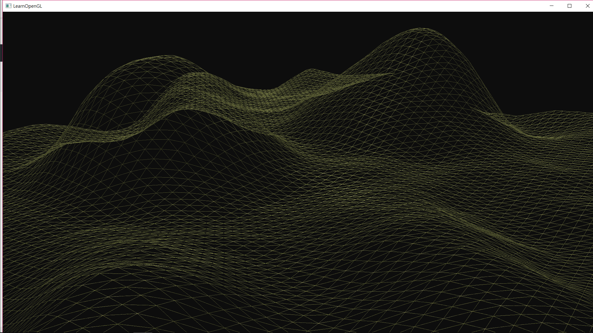

# Terrain
This is a terrain generating program based on OpenGL and GLFW.
Note that the basic Camera header and Shader header files were based on https://learnopengl.com/

This is the result of the screenshot

I used GL_TRIANGLE_STRIP to make the terrains. Here are the grids that made this terrain.

I also made the grids considering the command glEnable(GL_CULL_FACE);
The indices algorithm was developed by me.
